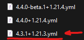

Requires Python 3.11

> [!WARNING]
> This tool is made for the sole purpose of automating stuff when i develop my modpacks. It is therefore not made to be user friendly or flexible in any way as it requires a very specific workflow to function.
> Long story short, i do not recommend that anyone else uses this tool due to those reasons.

## Credits

- [packwiz](https://github.com/packwiz/packwiz) — used to manage the mod metadata format and pack index. The CurseForge community API key bundled in this tool is sourced from the packwiz project.
- [mmc-export](https://github.com/RozeFound/mmc-export) — the fingerprint-based CurseForge export (murmur2 hash resolution via `/v1/fingerprints`) is based on the approach used by mmc-export.

## Current behavior

The script (`Modpack-Export.py`) assumes this repo layout:

- `../settings.yml` (next to `Packwiz`, `Changelogs`, `Export`, `Server Pack`)
- `../Packwiz/pack.toml`
- `packwiz.exe` at `%USERPROFILE%\go\bin\packwiz.exe`

If these paths do not match your setup, the workflow will fail.

## Action menu

At startup, the tool shows an action menu so you can choose what to run for this session:

- `1)` Run configured workflow (settings.yml)
- `2)` Migration only
- `3)` Export client only
- `4)` Export server only
- `5)` Migration + export client
- `6)` Migration + export client + server
- `7)` Refresh only
- `8)` Update mods only
- `9)` Bump modpack version only
- `10)` Clear stored repository data
- `11)` Generate changelog summary only
- `12)` List disabled mods
- `13)` Add mod
- `14)` Find orphaned library mods
- `0)` Exit

## Export

### Client export

The client export is controlled by `client_export_multi_platform` in `settings.yml`:

- **`false`** (default) — generates a CurseForge zip only, delegating to `packwiz cf export`.
- **`true`** — generates both a CurseForge zip and a Modrinth `.mrpack` using the native fingerprint-based exporter.

#### Single-platform export (`client_export_multi_platform: false`)

Calls `packwiz {format} export` via subprocess. The target format is controlled by `client_export_format` in `settings.yml`:

- `curseforge` (default) — produces a CurseForge `.zip`
- `modrinth` — produces a Modrinth `.mrpack`

Packwiz handles manifest generation and propagates `side` metadata from each mod's `.pw.toml` into the manifest `required` flags. The output file is moved to the Export directory.

#### Multi-platform export (`client_export_multi_platform: true`)

Uses the native fingerprint-based exporter:

**CurseForge:** Mods are resolved using a two-path strategy:

1. **Fast path** — mods already tracked with `[update.curseforge]` metadata use their stored project-id and file-id directly.
2. **Fingerprint path** — mods tracked via Modrinth (or direct URL) are downloaded in parallel, their CurseForge murmur2 fingerprint is computed, and a single batch POST to the CF `/v1/fingerprints` API resolves their project-id and file-id. This mirrors the approach used by mmc-export.

Mods whose fingerprint is not found on CurseForge (MR-exclusive mods, or mods whose Modrinth and CF JARs differ) are bundled as JAR overrides.

**Modrinth:** Mods with `[update.modrinth]` metadata are listed in `modrinth.index.json` directly (no download needed). CurseForge-only mods are downloaded from CF and bundled as overrides.

### Server export

Server export still requires a manual step: after the CurseForge zip is generated, you are prompted to create a new instance in the CurseForge launcher from that zip and drag its `mods` folder path into the terminal. The tool then copies and filters those mods into the server pack.

## Legacy comparison workflow

When migrating to a new Minecraft version (*For example, going from 1.21.3 to 1.21.4*), make sure to leave only the last changelog in the repository from the previous version like seen below.
This is due to the program reading the files and thereby being able to recognize that it should compare the first new version to that old one.
This comparison-note behavior is controlled by `changelog_include_compare_notice`.



### Modular compatibility settings

The previous `breakneck_fixes` switch has been split into focused settings:

- `client_export_multi_platform`: Generate both CurseForge and Modrinth packs natively (fingerprint-based resolution). When `false`, a single pack is produced via packwiz using `client_export_format`.
- `client_export_format`: Target format for single-platform export (`curseforge` or `modrinth`). Default: `curseforge`. Ignored when `client_export_multi_platform` is `true`.
- `show_export_mode_notice`: Show a confirmation prompt when export actions are enabled.
- `changelog_template_use_overview_layout`: Create new changelog files with `Update overview` + block-style `Config Changes` template.
- `changelog_include_compare_notice`: Add the "comparison to previous version" info box in generated markdown changelog files.
- `comparison_files_use_versioned_packwiz_root`: Enables version-ranged comparison download roots.
- `comparison_files_versioned_root_pattern`: Root format when the version range matches (supports `{mc_version}` and `{version}`).
- `comparison_files_versioned_root_min_version` / `comparison_files_versioned_root_max_version`: Inclusive version range for the custom comparison root.

`breakneck_fixes` is still accepted as a legacy compatibility preset; when set to `true`, it auto-enables the modular flags above unless they are already defined.

## Automated Minecraft migration

You can enable automated migration in `settings.yml`:

- `migrate_minecraft_version`: Enables the migration flow.
- `migration_target_minecraft`: Target Minecraft version.
- `migration_target_mod_loader`: Optional target loader (`fabric`, `quilt`, `forge`, `neoforge`). Defaults to current loader.
- `migration_target_mod_loader_version`: Target version for the selected loader. Required when switching loaders.
- `migration_target_fabric`: Legacy alias for Fabric loader version (still supported).
- `migration_mod_loader`: Loader used for compatibility checks (normally auto-aligned to target loader).
- `alpha_update_policy`: `prompt` asks before allowing non-alpha mods to move to alpha; `always_skip` always blocks that move.
- `migration_update_all_mods`: Runs `packwiz update --all -y` after changing MC version.
- `migration_disable_incompatible_mods`: Disables mods that do not have a target-compatible update.

When enabled, the tool will:

1. Update `Packwiz/pack.toml` to the target Minecraft version and selected modloader/version.
2. Refresh and update mods with Packwiz.
3. Disable incompatible mods by setting `side = "...(disabled)"` in their `.toml` entries.

## Auto-generated changelog text

The export flow can auto-populate changelog fields in `Changelogs/<version>+<mc_version>.yml`:

- `Update overview` is deterministic and generated from local diff data.
- `Config Changes` can be generated with an LLM from config file diffs.

### Settings

- `auto_generate_update_overview`: Enables deterministic `Update overview` generation during export.
- `auto_summary_overwrite_existing`: Overwrites existing `Update overview` when `true`.
- `auto_generate_config_changes`: Enables LLM generation for `Config Changes`.
- `auto_config_overwrite_existing`: Overwrites existing `Config Changes` when `true`.
- `auto_config_include_removed_files`: Includes removed config-file bullets in `Config Changes` when `true`.
- `auto_config_provider`: Provider name (`ollama` currently supported).
- `auto_config_model`: Model used by Ollama (default: `qwen3:4b-instruct`).
- `auto_config_endpoint`: Ollama generate endpoint (default: `http://127.0.0.1:11434/api/generate`).
- `auto_config_timeout_seconds`: HTTP timeout for the model call.
- `auto_config_temperature`: Creativity for config bullets (default: `0.25`); higher values allow more varied wording.
- `auto_config_max_items`: Max config diff items per category included in the prompt.
- `auto_config_max_lines`: Max output bullet lines written to `Config Changes`.

`Config Changes` generation provides full previous/current contents for modified config files so the model can infer meaningful option/value changes with broader context.

### Requirements

For `Config Changes`, run Ollama locally and pull a model, for example:

```powershell
ollama pull qwen3:4b-instruct
```

If the model call fails or no model is available, the tool does not write `Config Changes` and prints a notice instead.

## Notable runtime prompts

- Migration actions can prompt for target Minecraft version, modloader, and modloader version if not set in `settings.yml`.
- When summary generation is active, the script prompts whether to overwrite existing `Update overview` / `Config Changes` for the current run.
- Server export includes a manual step where you provide a dragged `mods` folder path from a CurseForge launcher instance built from the just-exported zip.
